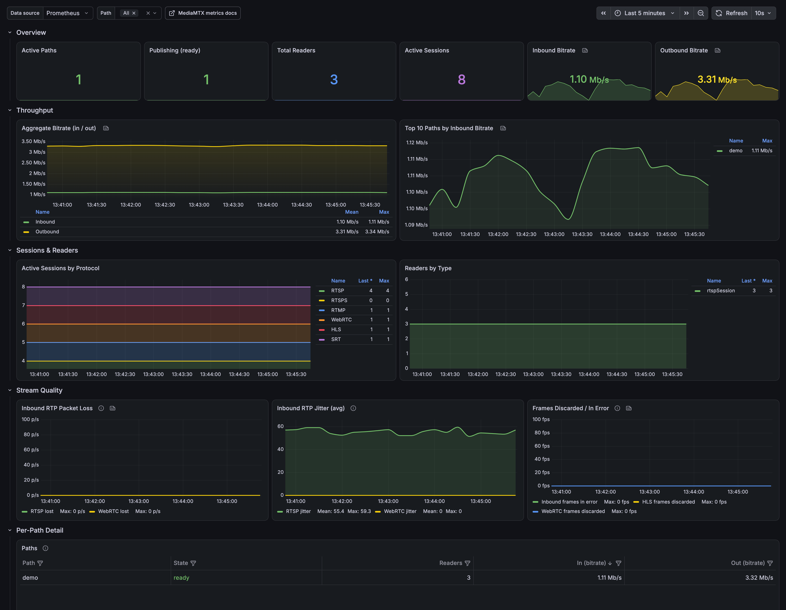

# MediaMTX Grafana Dashboard

A clean, **fleet-ready** Grafana dashboard for [MediaMTX](https://github.com/bluenviron/mediamtx), built on its native Prometheus metrics endpoint. Ships with a one-command demo stack (MediaMTX + a synthetic stream + Prometheus + Grafana) so you can see it working in under a minute.

> MediaMTX exposes **per-entity** metrics — every path, session, and connection is its own labeled series. This dashboard does the aggregation for you (`count()` the entities, `rate()` the byte counters into bitrates, `sum by (state / readerType)`), so it works for a single node **or** a whole fleet of nodes scraped by one Prometheus.

<!-- TODO(release): images/ is empty. Run the demo stack below, capture the dashboard to
     images/overview.png, then delete these comment markers to publish the screenshot.
 -->

## Quick start (demo)

<!-- TODO(release): OWNER below is a placeholder — this repo has no remote yet. Replace it with
     the real GitHub owner once the repository is pushed. Do not guess the URL. -->

```bash
git clone https://github.com/OWNER/mediamtx-grafana-dashboard
cd mediamtx-grafana-dashboard
docker compose up -d
```

Then open **http://localhost:3300** (login `admin` / `admin`) → **Dashboards → MediaMTX → MediaMTX — Fleet Overview**. A synthetic 720p test stream is published automatically, so the panels populate immediately.

> Grafana is exposed on **3300** (not its default 3000) to avoid colliding with common dev servers. Prometheus is on `:9090`, MediaMTX metrics on `:9998`.

Tear down with `docker compose down`.

## Use with your own MediaMTX

1. **Enable metrics** in your `mediamtx.yml`:

   ```yaml
   metrics: yes
   metricsAddress: :9998
   ```

   > **Gotcha:** MediaMTX's default internal auth only permits the `metrics`
   > action from `127.0.0.1` / `::1`. A Prometheus on another host/container
   > scrapes from a non-localhost IP and gets `{"status":"error","error":"authentication error"}`.
   > Grant the `metrics` action to your Prometheus source IP (see the
   > [`mediamtx.yml`](mediamtx.yml) in this repo for the exact block; tighten
   > `ips:` to your Prometheus host in production).

2. **Scrape it** from your Prometheus:

   ```yaml
   scrape_configs:
     - job_name: mediamtx
       metrics_path: /metrics
       static_configs:
         - targets:
             - node-1.internal:9998
             - node-2.internal:9998   # list every node for a fleet view
   ```

3. **Import the dashboard**: in Grafana, **Dashboards → New → Import**, upload [`dashboard.json`](dashboard.json) (or paste its contents), and pick your Prometheus data source when prompted.

## What's on it

| Section | Panels |
| --- | --- |
| **Overview** | Active paths, publishing (ready) paths, total readers, active sessions (all protocols), inbound & outbound bitrate |
| **Throughput** | Aggregate in/out bitrate over time; top 10 paths by inbound bitrate |
| **Sessions & Readers** | Active sessions by protocol (RTSP, RTSPS, RTMP, WebRTC, HLS, SRT); readers by type |
| **Stream Quality** | Inbound RTP packet loss (RTSP + WebRTC); inbound RTP jitter; frames discarded / in error |
| **Per-Path Detail** | Sortable, filterable table: state, readers, in/out bitrate per path |

A **Path** template variable (multi-select) filters the whole dashboard to specific streams; a **Data source** variable lets you point it at any Prometheus.

## Metrics required

Every series this dashboard queries, and what breaks without it. All of these come from the
single MediaMTX `/metrics` endpoint — no exporters, no sidecars.

| Metric | Labels used | Powers |
| --- | --- | --- |
| `paths` | `name`, `state` | Active Paths, Publishing (ready), Per-Path table, the **Path** variable |
| `paths_readers` | `name`, `readerType` | Total Readers, Readers by Type, Per-Path table |
| `paths_inbound_bytes` | `name` | Inbound Bitrate, Aggregate Bitrate, Top 10 Paths, Per-Path table |
| `paths_outbound_bytes` | `name` | Outbound Bitrate, Aggregate Bitrate, Per-Path table |
| `paths_inbound_frames_in_error` | `name` | Frames Discarded / In Error |
| `rtsp_sessions` | `path` | Active Sessions, Active Sessions by Protocol |
| `rtsps_sessions` | `path` | Active Sessions, Active Sessions by Protocol |
| `rtmp_conns` | `path` | Active Sessions, Active Sessions by Protocol |
| `srt_conns` | `path` | Active Sessions, Active Sessions by Protocol |
| `hls_sessions` | `path` | Active Sessions, Active Sessions by Protocol |
| `webrtc_sessions` | `path` | Active Sessions, Active Sessions by Protocol |
| `rtsp_sessions_inbound_rtp_packets_lost` | `path` | Inbound RTP Packet Loss |
| `rtsp_sessions_inbound_rtp_packets_jitter` | `path` | Inbound RTP Jitter |
| `webrtc_sessions_inbound_rtp_packets_lost` | `path` | Inbound RTP Packet Loss |
| `webrtc_sessions_inbound_rtp_packets_jitter` | `path` | Inbound RTP Jitter |
| `webrtc_sessions_outbound_frames_discarded` | `path` | Frames Discarded / In Error |
| `hls_muxers_outbound_frames_discarded` | *(none)* | Frames Discarded / In Error |

**The label name differs by family.** Path-level metrics (`paths*`) label the stream `name`;
per-session and per-connection metrics label it `path`. That asymmetry is upstream, not a typo
here — it's why the **Path** variable is built from `label_values(paths, name)` but the session
panels match on `path=~`.

**Checking your server.** MediaMTX only emits a metric family when a matching entity is live —
with no WebRTC viewer connected, `webrtc_sessions` is absent rather than `0`, so a bare "is it
in the output" check gives false alarms. Confirm the path-level families (always present once a
path is configured), and check the session families while a session of that type is actually up:

```bash
curl -s http://localhost:9998/metrics | sed 's/[{ ].*//' | sort -u
```

Any name in the table above that is missing *while an entity of that type is live* means your
MediaMTX predates that metric; the corresponding panel will read empty (the dashboard's
`or vector(0)` fallbacks keep the stat panels showing `0` rather than "No data").

> **Known gap:** `hls_muxers_outbound_frames_discarded` is labeled `name`, not `path`, and the
> Frames Discarded panel queries it unfiltered — so that one series ignores the **Path**
> variable while the other two series in the panel respect it.

## Notes on the metrics

- Byte counters (`paths_inbound_bytes`, etc.) are cumulative — the dashboard applies `rate(...) * 8` to show **bitrate in bits/sec**.
- Entity gauges (`paths`, `rtsp_sessions`, `webrtc_sessions`, …) are `1` per live entity, so `count()` gives the live total. Empty results fall back to `0` via `or vector(0)`.
- Jitter is shown in the metric's raw units as reported by MediaMTX (unscaled).
- Full metric reference: [MediaMTX metrics docs](https://mediamtx.org/docs/features/metrics).

## Compatibility

- **Grafana** 10.x / 11.x (dashboard schema v39).
- **MediaMTX** with the metrics endpoint enabled — see [Metrics required](#metrics-required)
  (metric and label names re-verified against the upstream docs, August 2026).
- **Prometheus** any recent version.

## Contributing

Issues and PRs welcome — extra panels (SRT link stats, MoQ sessions), alert rules, and recording-panel additions are all fair game.

## License

Released under the [MIT License](LICENSE) — free to use, modify, and redistribute, including
commercially.
